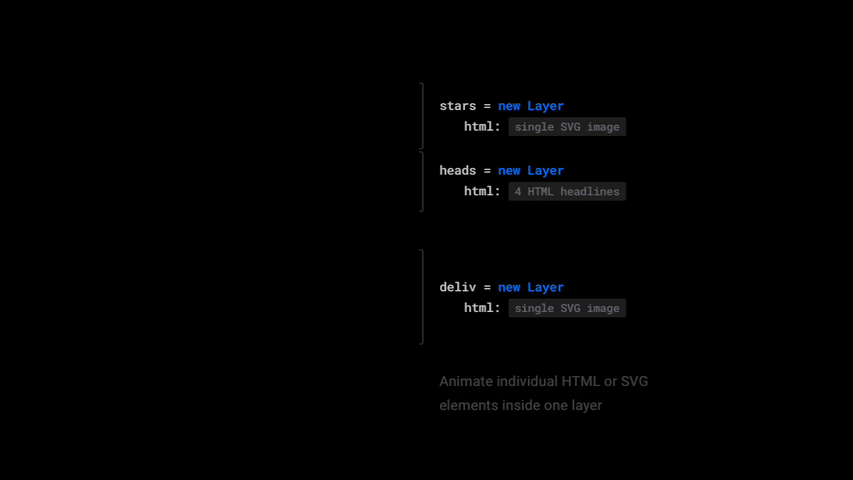

# ClassAnimation Module for Framer

[](https://framer.cloud/aMvYj/)

A simple module that allows you **animate individual HTML and SVG elements** inside your 
layer's **html** property in addition to Framer's core per-layer Animation.

Shout out to [Velocity.js](http://velocityjs.org) for making great animation library &hearts;

## Install
<a href='https://open.framermodules.com/Class Animation'>
    </a>


or

1. [Download the module](ClassAnimation.coffee?raw=true)
2. Copy the `ClassAnimation.coffee` file to your prototype's `modules` folder.
3. Call `{ClassAnimation} = require "ClassAnimation"` in your Framer prototype.

ClassAnimation module depends on Velocity.js library. If you want to use your prototype offline,
please download [velocity.min.js](https://github.com/julianshapiro/velocity/raw/master/velocity.min.js) 
and also include it in your
`modules` folder. Otherwise, the module will download the library from web and you don't need to worry about it.

## How to Use [(see the live demo)](https://framer.cloud/aMvYj/)

Import the module and optional handy [Style](#bonus-set-your-styles-like-a-human-being) function for fancy CSS initiation.
```coffeescript
{ClassAnimation} = require "ClassAnimation"
{Style} = require "ClassAnimation" # Optional
```

### Animate

Module is designed to mimic Framer's core `Animation` as much as possible
in order to make it easier to work with. 

Thanks to that, it takes similar inputs as the default Framer animation—just 
instead of `layer` use `string` with the name of class you want to animate.


```coffeescript
socialCard = new Layer

socialCard.html = 
	"""
	<h2 class='className'>Paul Paulson</h2>
	<span class='differentClass'>Montessori Teacher</span>
	"""

# Create a new animation for "className" class
animationA = new ClassAnimation "className",
	color: "#ff00ff"
	fontSize: 60
	lineHeight: 70
	borderWidth: 5


animationA.start()
```

### Animatable Properties [(see the full list)](AnimatableProperties.md)
Because the module depends on Velocity.js library, it will animate whatever Velocity can animate.

Although most properties are same as in core animation, there are very few exceptions, such as instead 
`rotation` you might want to use `rotateZ`.

ClassAnimation *will print message if you use unsupported property* and will log the full
list of supported ones to the console.

<sub><sup>If you find property you know Velocity can animate but ClassAnimation returns
as unsupported, please [send me an e-mail about the issue](mailto:kyselyradek@gmail.com)</sup></sub>


### Options
Same options as core Animation are available, only `curve` takes different value format 
and `repeat` has the option `true` to repeat forever.

```coffeescript
animationB = new ClassAnimation "className",
	color: "#ff00ff"
	fontSize: 60
	lineHeight: 70
	borderWidth: 5
	options:
		time: 2
		delay: .5
		repeat: 2
		curve: "spring"

animationB.start()
```

#### Curve Options
`curve: "linear"`

`curve: "ease"`

`curve: "ease-in"`

`curve: "ease-out"`

`curve: "ease-in-out"` *(default)*

`curve: [0, 1, 0, 1]` 4 parameters for [Bézier curve](http://cubic-bezier.com/)

`curve: "spring"`

`curve: [500, 20]` custom spring [tension, friction]

For all the available magic and per-property curves, see [Velocity.js docs](http://velocityjs.org/#easing)


### Methods
**`animation.toggle()`** switches between default and animated states 

**`animation.fadeIn()`** / **`animation.fadeOut()`** shows/hides elements targeted by animation

*plus methods you know from core Animation:*

**`animation.start()`**

**`animation.stop()`**

**`animation.reverse()`**

**`animation.reset()`**

**`animation.restart()`**

### Events
**`Events.Animation`** returns progress `(0 to 1)` and remaining time `(ms)` **during animation**

*plus events you know core Animation:*

**`Events.AnimationStart`** doesn't return any value

**`Events.AnimationStop`** doesn't return any value

**`Events.AnimationEnd`** doesn't return any value

```coffeescript
# Event Shortcuts

animationA.onAnimation (prog, remain) ->
	print "#{prog*100}% done"
	print "#{remain}ms left"

animationA.onAnimationStart ->
	print "Animation started"
 
animationA.onAnimationStop ->
	print "Animation stopped"
   
animationA.onAnimationEnd ->
	print "Animation ended"
```

## "But where's my .animate()?"
Right here.

```coffeescript
"className".animate
	color: "#ff00ff"
	fontSize: 60
	lineHeight: 70
	borderWidth: 5
	options:
		time: 2
		delay: .5
		repeat: 2
		curve: "spring"


# You can also directly fadeIn/Out on any string
"className".fadeOut()
"differentClass".fadeIn()
```


## Bonus: Set your styles like a human being

In case you tried writing your styles as CSS strings—or even worse, in-line
inside the layer's html property—see this:

```coffeescript
{Style} = require "ClassAnimation"

# Style(name,props) helps you set your styles
# in a cultivated way (as object, in camelCase)
Style "className",
	fontSize: 50
	color: "#ff0000"
	borderWidth: 1
	borderColor: "rgb(255, 255, 0)"


socialCard = new Layer
socialCard.html = 
	"""
	<h2 class='className'>Paul Paulson</h2>
	<span class='differentClass'>Montessori Teacher</span>
	"""


# PS: If you already have a CSS string, just call .css()
# method on it (this doesn't require {Style} import)
".differentClass {font-size: 30px; color: #ff00ff}".css()
```
